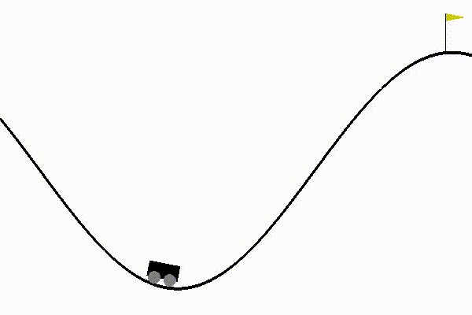

# CartPole - using Open AI gym 

(see: https://gym.openai.com/envs/CartPole-v1/)

Model:\
Q-learning technique + RBF network

Required libraries:

1) numpy
2) matplotlib 
3) pickle 
4) gym 
5) sklearn

