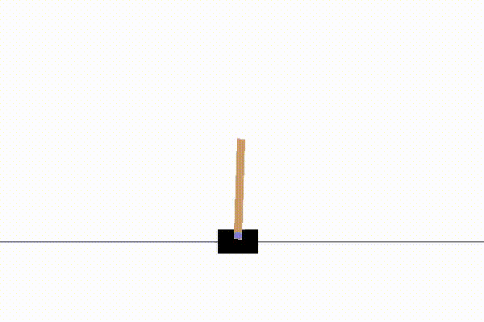

# CartPole - using Open AI gym 

(see: https://gym.openai.com/envs/CartPole-v1/)

Q-learning along with a linear system to estimate the action-value function, Q(s,a), were used here.

Required libraries:

1) numpy
2) matplotlib 
3) pickle 
4) gym 
5) sklearn

If you wish to examine a trained agent, please load the weights of the linear equation and
the features of the radial-basis function by using model(..., load = True).

